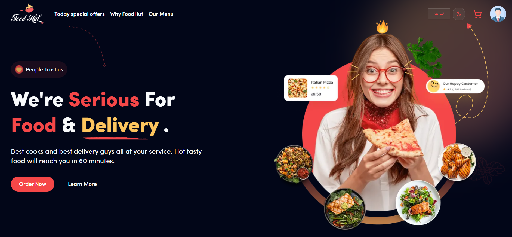
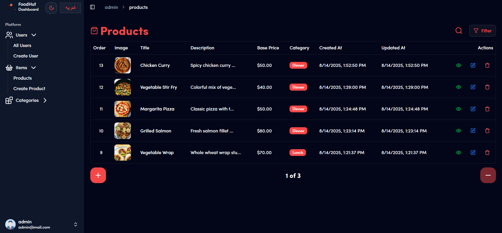
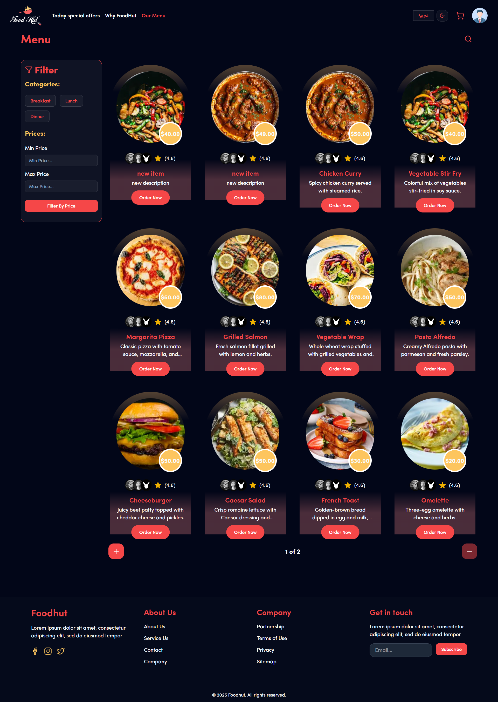

# 🍔 Food Hut – Full Stack Food Ordering App




## 📌 Overview
**Food Hut** is a modern, full-stack food ordering application built with a powerful tech stack:  
**Next.js, TypeScript, Tailwind CSS, shadcn/ui, Redux Toolkit, Zod, and i18n**.  
The app is split into **two main sections**:  

- **Dashboard (Admin Panel)**: Manage products, categories, and users with full CRUD operations.
- **Website (Customer Side)**: Browse food items, add to cart, and enjoy a seamless ordering experience.

---

## 🚀 Features
- **🔄 Full Stack**: Dashboard + Website in one project.
- **🛠 CRUD Operations**: Manage users, products, and categories in the dashboard.
- **📡 Server Actions + useActionState** for optimized server-client communication.
- **🌍 Multi-language Support**: English 🇬🇧 & Arabic 🇪🇬.
- **🌓 Dark Mode** for better user experience.
- **✅ Robust Validation** using Zod.
- **⚡ State Management** with Redux Toolkit.
- **🎨 Fully Responsive** UI with Tailwind CSS & shadcn/ui.
- **🔍 Advanced Search**: Quickly find products by name or category.
- **📑 Pagination**: Smooth navigation through large data sets.
- **🎯 Filtration**: Filter products by category, price range, and more.

---

## 🖼 Screenshots
### Website – Hero Section


### Dashboard


### Search, Filtration & Pagination


---

## 🏗 Tech Stack
- **Framework**: [Next.js](https://nextjs.org/) + [TypeScript](https://www.typescriptlang.org/)
- **UI**: [Tailwind CSS](https://tailwindcss.com/) + [shadcn/ui](https://ui.shadcn.com/)
- **State Management**: [Redux Toolkit](https://redux-toolkit.js.org/)
- **Validation**: [Zod](https://zod.dev/)
- **Internationalization**: [next-intl](https://next-intl-docs.vercel.app/) / i18n
- **Data Handling**: Server Actions & useActionState

---

## 📦 Installation & Setup
```bash
# Clone the repository
git clone https://github.com/your-username/food-hut.git

# Navigate into the project folder
cd food-hut

# Install dependencies
npm install

# Run development server
npm run dev
